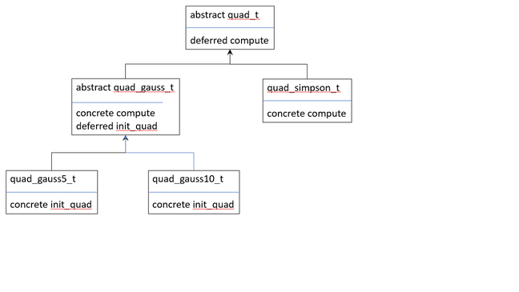

# Abstract classes

When designing a class hierarchy, it is not always possible to have concrete
implementations of procedures in the base class.  However, you know for sure
that each derived class will have to have an implementation.  This is a use
case for abstract classes.

For example, consider a family of related algorithms, for instance quadrature
methods.  We will consider two methods,
[Simpson's rule](https://en.wikipedia.org/wiki/Simpson%27s_rule) and
[Legendre-Gauss quadrature](https://pomax.github.io/bezierinfo/legendre-gauss.html).
For Legendre-Gauss quadrature, you can control the precision by the number
of points used in the computation.  We will implement a 5 point and a 10 point
method.

This gives us a total of three quadrature algorithms: Simpson's rule, and
Legendre-Gauss with a 5 point and a 10 point implementation.  In fact the only
thing that differs between these last two algorithms is the values of abscissae
and weights used in the computation.  The evaluation of the integral is same
for both.

On an abstract level, each method has a procedure that takes a function $$f$$
and the boundaries $$a$$ and $$b$$ as argument, and returns an approximation for
$$
    \int_a^b f(x) dx
$$

The name of that  procedure will be the same for all three algorithms, i.e.,
`compute`, but the implementation will vary.

For the Legendre-Gauss algorithm, a procedure to initialize the abscissae and
weights is required.  That procedure will have the same name for both
implementations, i.e., `init_quad`.

You could pick one of the algorithms as the base class, but that would be
awkward.  Suppose you would choose Simpson's rule as the base class.  The two
Legendre-Gauss algorithms could be derived classes of that, but that is quite
unnatural, since a Legendre-Gauss is not Simpson's rule.  Similarly, using
Legendre-Gauss as the base class feels equally inappropriate.

This is in fact a nice motivating example for abstract classes.  Every
quadrature algorithms will have a `compute` type bound procedure.  This can
be formalized by defining an abstract class `quad_t` with a deferred type bound
procedure.  A deferred procedure is declared, i.e., its interface is defined,
but it is not defined, i.e., implemented for the abstract class `quad_t`.

~~~~fortran
module quad_mod
    implicit none

    private

    type, public, abstract :: quad_t
    contains
        procedure(compute_t), pass, deferred :: compute
    end type

    abstract interface
        function compute_t(this, func, a, b) result(val)
            import :: quad_t
            implicit none
            class(quad_t), intent(in) :: this
            procedure(func_t) :: func
            real, value :: a, b
            real :: val
        end function compute_t
    end interface

    interface
        function func_t(x) result(res)
            implicit none
            real, value :: x
            real :: res
        end function func_t
    end interface

end module quad_mod
~~~~

As you can see, the module `quad_mod` defines no implementation at all.  It
defines a user defined type `quad_t` with a single type bound procedure
`compute`.  However, the latter is deferred, so its signature is specified
through an abstract interface for `compute_t`.

The class that implements Simpson's rule will define its own specific version
of compute for that particular algorithm.

~~~~fortran
module quad_simpson_mod
    use :: quad_mod
    implicit none

    private
    type, public, extends(quad_t) :: quad_simpson_t
    contains
        procedure :: compute => compute_simpson
    end type

    interface
        function func_t(x) result(res)
            implicit none
            real, value :: x
            real :: res
        end function func_t
    end interface

    interface quad_simpson_t
        module procedure :: create_quad
    end interface

contains

    function create_quad() result(quad)
        implicit none
        type(quad_simpson_t) :: quad
    end function create_quad

    function compute_simpson(this, func, a, b) result(res)
        implicit none
        class(quad_simpson_t), intent(in) :: this
        procedure(func_t) :: func
        real, value :: a, b
        real :: res
        integer, parameter :: n = 10
        integer :: i
        real :: delta_x

        delta_x = (b - a)/n
        res = func(a) + func(b)
        do i = 1, n - 1, 2
            res = res + 4.0*func(a + i*delta_x)
        end do
        do i = 2, n - 1, 2
            res = res + 2.0*func(a + i*delta_x)
        end do
        res = res*delta_x/3.0
    end function compute_simpson

end module quad_simpson_mod
~~~~

The user defined type `quad_simpson_t` extends `quad_t` and associates the
deferred procedure `compute` with the concrete implementation
`compute_simpson`.

The named interface `quad_simpson_t` and the `create_quad` procedure provide a
constructor which will come in handy later.

The derived class for the Legendre-Gauss algorithms is itself an abstract class
since the procedure to initialize abscissae and weights is specific to each
algorithm.

~~~~fortran
module quad_gauss_mod
    use :: quad_mod
    implicit none

    private
    type, public, abstract, extends(quad_t) :: quad_gauss_t
        private
        real, dimension(:), allocatable :: abscissae, weights
    contains
        procedure :: compute => compute_gauss
        procedure(init_quad_t), pass, deferred :: init_quad
        procedure :: set_abscissae, set_weights
    end type

    interface
        module subroutine init_quad_t(this)
            ! import :: quad_gauss_t
            implicit none
            class(quad_gauss_t), intent(inout) :: this
        end subroutine init_quad_t
    end interface

    interface
        function func_t(x) result(res)
            implicit none
            real, value :: x
            real :: res
        end function func_t
    end interface

contains

    function compute_gauss(this, func, a, b) result(res)
        implicit none
        class(quad_gauss_t), intent(in) :: this
        procedure(func_t) :: func
        real, value :: a, b
        real :: res
        integer :: i

        res = 0.0
        associate (x => this%abscissae, w => this%weights)
            do i = 1, size(x)
                res = res + 0.5*(b - a)*w(i)*func(0.5*((b - a)*x(i) + a + b))
            end do
        end associate
    end function compute_gauss
        
    subroutine set_abscissae(this, abscissae)
        use, intrinsic :: iso_fortran_env, only : error_unit
        implicit none
        class(quad_gauss_t), intent(inout) :: this
        real, dimension(:), intent(in) :: abscissae
        integer :: istat

        allocate(this%abscissae, source=abscissae, stat=istat)
        if (istat /= 0) then
            write (unit=error_unit, fmt='(A)') 'error: can not allocate abscissae'
            stop 1
        end if
    end subroutine set_abscissae

    subroutine set_weights(this, weights)
        use, intrinsic :: iso_fortran_env, only : error_unit
        implicit none
        class(quad_gauss_t), intent(inout) :: this
        real, dimension(:), intent(in) :: weights
        integer :: istat

        allocate(this%weights, source=weights, stat=istat)
        if (istat /= 0) then
            write (unit=error_unit, fmt='(A)') 'error: can not allocate weights'
            stop 1
        end if
    end subroutine set_weights

end module quad_gauss_mod
~~~~

Just like for Simpson's rule, we can define associate the deferred procedure
`compute` to a concrete implementation `compute_gauss`.  However, the abstract
class `quad_gauss_t` defines a deferred type bound procedure `init_quad` and
hence is abstract.

The classes `quad_gauss5_t` and `quad_gauss10_t` will each have a specific
implementation for `quad_init`, i.e., for `quad_gauss5_t`:

~~~~fortran
subroutine init_quad5(this)
    implicit none
    class(quad_gauss5_t), intent(inout) :: this

    call this%set_abscissae([ &
         0.0000000000000000,  &
        -0.5384693101056831,  &
         0.5384693101056831,  &
        -0.9061798459386640,  &
         0.9061798459386640   &
    ])

    call this%set_weights([ &
        0.5688888888888889, &
        0.4786286704993665, &
        0.4786286704993665, &
        0.2369268850561891, &
        0.2369268850561891  &
    ])
end subroutine init_quad5
~~~~

Just like `quad_simpson_t` the class `quad_gauss5_t` and `quad_gauss10_t`
define a named interface for a constructor.  The implementation for
`quad_gauss5_t` is shown below.

~~~~fortran
function create_quad() result(quad)
    implicit none
    type(quad_gauss5_t) :: quad
    call quad%init_quad()
end function create_quad
~~~~

The constructor will call the procedure to initialize the object.

Finally, the quadrature algorithm to use can be selected at runtime easily.

~~~~fortran
...
use :: quad_mod
use :: quad_gauss_mod
use :: quad_gauss5_mod
use :: quad_gauss10_mod
use :: quad_simpson_mod
...
class(quad_t), allocatable :: quad
character(len=20) :: method
...
select case (method)
case ('quad5')
    allocate(quad, source=quad_gauss5_t())
case ('quad10')
    allocate(quad, source=quad_gauss10_t())
case ('simpson')
    allocate(quad, source=quad_simpson_t())
case default
    write (unit=error_unit, fmt='(3A)') 'error: method ', trim(method), &
        ' is not implemented'
    stop 11
end select
print '(F10.7)', quad%compute(func, 0.0, PI)
...
~~~~

The relationships between the various classes are illustrated in the class
diagram below.

