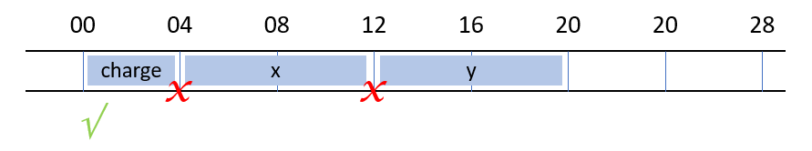
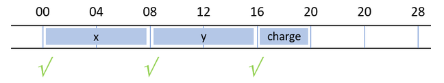

# Data alignment

For best performance, data items should be aligned on certain address
boundaries in memory.

* 8-bit data (e.g., `character` or integer kind `INT8`) can be placed anywhere;
* 16-bit data (e.g., integer kind `INT16`) should be placed on addresses that
  are multiples of 4 bytes;
* 32-bit data (e.g., integer kind `INT32` or real kine `REAL32`) should be
  placed on addresses that are multiples of 4 bytes;
* 64-bit data (e.g., integer kind `INT64` or real kind `REAL64`) should be
  placed on addresses that are multiples of 8 bytes;
* 128-bit data (e.g., real kind `REAL128`) should be placed on addresses that
  are multiples of 16-byte.

You should understand the phrase "multiple of n bytes" as placed on a multiple
of n bytes with respect to the base address.

This alignment is called natural, and in general, the compiler will ensure
that this is indeed the memory layout, adding padding as required for natural
alignment.

However, there are a few situations in which the compiler will not enforce
natural alignment.  This is the case for old-style constructs such as
`structure` and `record`, as well as common blocks.  If you (have to) use
these constructs, you would have to ensure that data is naturally aligned by
appropriately specifying the order of the data items or variables.  Some
compilers have flags to align common blocks automatically.

A situation that is still relevant in modern Fortran is the use of `sequence`
in a user defined type.  Since this is often required in the context of using
the Message Passing Interface (MPI) it is useful to understand alignment.

## Aligned versus non-aligned data

Consider the following user defined type definition:

~~~~fortran
type :: particle_t
    sequence
    integer :: charge
    real(kind=REAL64) :: x, y
end type
~~~~

Due to the `sequence` statement, the compiler will not naturally align the
data.  In this case, `x` and `y` will not be aligned, which has a performance
impact.  This is illustrated in the figure below.

Changing the order of the elements of the `particle_t` user defined type solves
this issue.

~~~~fortran
type :: particle_t
    sequence
    real(kind=REAL64) :: x, y
    integer :: charge
end type
~~~~

Now none of the elements cross alignment boundaries as illustrated in the
figure below.

