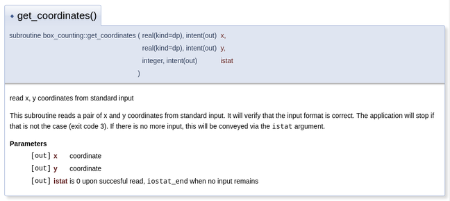
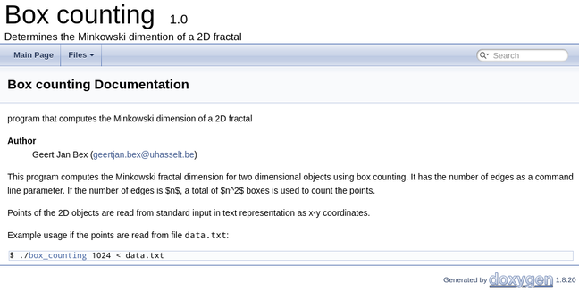

# Documentation using Doxygen

Writing proper documentation is an integral part of software development that
is sadly often neglected.  It is often perceived as a chore, but keeping
documentation up-to-date and in sync with your code need not be hard or
tedious.  Doxygen is a very nice tool to generate professional looking
documentation.  It can be used for software projects developed in many
programming langauges, including Fortran.

Writing API (Application Programming Interface) documentation simply boils down
to adding comments to a procedure that mentions
* its intent,
* a description,
* its arguments, including the type and semantics,
* its return type, if any.
Documentation at the level of modules can be added as comments as well.

The doxygen tool will read the source code, extract the documentation and
render it as HTML or LaTeX.  The latter can easily be turned into a PDF
document.  Doxygen integrates nicely with CMake, hence the generation of
documenation is part of your build process.

Doxygen is quite sophisticated and offer many features and opportunities for
custimization that are beyond the scope of this introduction.  Here you will
see how to document your code and how to generate an HTML version of it.

Doxygen provides a number of special commands such as `@brief`, `@param` and
`@returns` to make it easier to render documentation consistently.  For the
description you can use Markdown, while formulas can be written in LaTeX.

## Procedure documentation

~~~~fortran
!> @brief read x, y coordinates from standard input
!>
!> This subroutine reads a pair of x and y coordinates from standard input. It
!> will verify that the input format is correct.  The application will stop if
!> that is not the case (exit code 3).  If there is no more input, this will be
!. conveyed via the `istat` argument.
!>
!> @param[out] x coordinate
!> @param[out] y coordinate
!> @param[out] istat is 0 upon succesful read, `iostat_end` when
!>             no input remains
subroutine get_coordinates(x, y, istat)
    use, intrinsic :: iso_fortran_env, only : input_unit, error_unit
    implicit none
    real(kind=DP), intent(out) :: x, y
    integer, intent(out) :: istat
    character(len=1024) :: msg

    read (unit=input_unit, fmt=*, iostat=istat, iomsg=msg) x, y
    if (istat == iostat_end) return
    if (istat /= 0) then
        write (unit=error_unit, fmt='(2A)') &
            'error: ', msg
        stop 3
    end if
end subroutine get_coordinates
~~~~

The `@brief` entry is intended for a brief description of the procedure.  This
can (optionally) be follow by a longer description of one or more paragraphs.
The arguments' intent (`in`, `out`, `inout`) and description can be specified
using `@param`.  For functions, you can use `@return` to describe the result.

Note that you don't have to specify the types of the arguments and return value
since doxygen is smart enough to figure that out from the procedure definition
itself.

This will be rendered to the following HTML document fragment.

## Other compilation units

Compilation units such as `program` or `module` can also be documented, e.g.,

~~~~fortran
!> @brief application to perform box counting to estiamte the fractal
!>        dismension of an 2D object
!>
!> The application assumes that the 2D is in a unit square defined by
!> the points (0, 0), (1, 0), (0, 1), (1, 1).  A command line argument
!> specifies the resolution of the boxes, e.g., 2 means that 4 boxes
!> are used, 8 would mean 64 boxes.
!> Data is read from standard input in the form of x,y-coordinates in
!> the interval [0.0, 1.0].
!>
program box_counting
   ...
end program box_counting
~~~~

This will be rendered as follows:

## Main page

To present more high-level documentation you can create a main page in Markdown
that serves as a landing page.  

~~~~
/*!
  @mainpage
  @brief program that computes the Minkowski dimension of a 2D fractal
  @author Geert Jan Bex (geertjan.bex@uhasselt.be)
  
  This program computes the Minkowski fractal dimension for two dimensional objects
  using box counting.  It has the number of edges as a command line parameter.
  If the number of edges is $n$, a total of $n^2$ boxes is used to count the points.

  Points of the 2D objects are read from standard input in text representation
  as x-y coordinates.

  Example usage if the points are read from file `data.txt`:
  ~~~~~~~~~~~~~
  $ ./box_counting 1024 < data.txt
  ~~~~~~~~~~~~~
*/
~~~~

This will be rended as shown below.

The generated HTML documentation is fully hyperlinked and searchable.

This file, `mainpage.dox` is stored in the `docs` directory, together with
the configuration template.

## Configuration

Doxygen can be configured on a per project basis.  It has many configuration
options so the easiest way to get started is to let doxygen generate a template
configuration file that you adapt to your needs.

~~~~bash
$ doxygen  -g
~~~~

There are a number of configuration options you definitely want to set such as
* `PROJECT_NAME`: the name of your project;
* `PROJECT_NUMBER`: the version number of your project;
* `PROJECT_BRIEF`: a brief description of the project;
* `OUTPUT_DIRECTORY`: when using CMake, this would be `@CMAKE_CURRENT_BINARY_DIR@/doc_doxygen/`;
* `OPTIMIZE_FOR_FORTRAN`: you want to set this to `YES`;
* `EXTENSION_MAPPING`: depending on the file name extensions you use, you can
  add what you require, e.g., `f90=FortranFree`.

The other settings are typically fine by default.

When you want CMake to generate the documentation as part of the build process,
this configuration file is best saved in a directory called `docs` and named
`Doxyfile.in`.

## CMake & doxygen

CMake can generate the documentation when you build your software, and this
was already assumed in the previous section.  The fragment of the
`CMakeLists.txt` responsible for this is shown below.

~~~~
option(BUILD_DOC "Build documentation" ON)

# check if Doxygen is installed
find_package(Doxygen)
if (DOXYGEN_FOUND)
    # set input and output files
    set(DOXYGEN_IN ${CMAKE_CURRENT_SOURCE_DIR}/docs/Doxyfile.in)
    set(DOXYGEN_OUT ${CMAKE_CURRENT_BINARY_DIR}/Doxyfile)

    # request to configure the file
    configure_file(${DOXYGEN_IN} ${DOXYGEN_OUT} @ONLY)
    message("Doxygen build started")

    # note the option ALL which allows to build the docs together with the application
    add_custom_target( doc_doxygen ALL
        COMMAND ${DOXYGEN_EXECUTABLE} ${DOXYGEN_OUT}
        WORKING_DIRECTORY ${CMAKE_CURRENT_BINARY_DIR}
        COMMENT "Generating API documentation with Doxygen"
        VERBATIM )
else (DOXYGEN_FOUND)
    message("Doxygen need to be installed to generate the doxygen documentation")
endif (DOXYGEN_FOUND)
~~~~

As you can see, the `Doxyfile.in` is first configure using the information for
the current build and transformed into `Doxyfile` in the binary directory.
Moreover, a custom target `doc_doxygen` is added for generating the
documentation.

When you use CMake to build your application, the HTML and LaTeX documentation
will be generated in the `doc_doxygen` subdirectory of the build directory.
