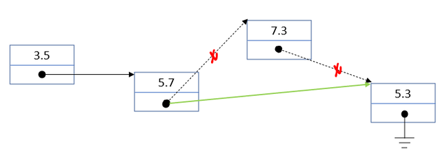

# Pointers

Although pointers are typically associated with programming languages such as
C and C++, but you can in fact use pointers in Fortran as well.  However, there
are substantial conceptual differences between pointers in C/C++ and Fortran.

In C/C++ a pointer is simply an address of data in memory.  In Fortran, a
pointer isn't an address, but is rather associated with data that has been
designated as a target.  During its lifetime, a pointer can be associated
with any number of targets.

## Pointer basics

Consider the following mathematical relation between a vector $$A$$ at time
$t + 1$$ as a function of the values of $$A$$ at $$t$$:
$$
    A_{t+1, i} = \frac{1}{4}A_{t, i-1} + \frac{1}{2}A_{t, i} + \frac{1}{4}A_{t, i+1}
$$
Starting from some initial values for $$A$$ at $$t = 0$$, what is the values
of $$A$$ after `nr_steps` time steps?

The code fragment below implements this.

~~~~fortran
...
real, dimension(nr_vals) :: A, A_new
integer :: t, i
...
do t = 1, nr_steps
    do i = 2, size(A) - 1
        A_new(i) = 0.25*A(i - 1) + 0.5*A(i) + 0.25*A(i + 1)
    end do
    A = A_new
end do
...
~~~~

For each time step, the values of the array `A_new` have to be copied to the
array `A`.  It would be more efficient if you could swap the roles of `A` and
`A_new` at each time step.  This can be achieved easily using pointers.

~~~~fortran
...
real, dimension(nr_vals), target :: A, A_new
real, dimension(:), pointer :: pA, pA_new, tmp
integer :: t, i
...
pA => A
pA_new => A_new
do t = 1, nr_steps
    do i = 2, size(A) - 1
        pA_new(i) = 0.25*pA(i - 1) + 0.5*pA(i) + 0.25*pA(i + 1)
    end do
    tmp => A
    A => A_new
    A_new => tmp
end do
...
~~~~

The arrays `A` and `A_new` can have pointers associated to them since they
are declared with the `target` attribute.  The variables `pA` and `pA_new` have
the same type as `A` and `A_new`.  Note that they are deferred-shape and have
the `pointer` attribute.

Pointers can be associated with variables using the `=>` operator.  The left
hand side operator is the pointer, the right hand side operator the target.

In this code fragment, the pointer `pA` is originally associated with the array
`A`, but in the iteration statement it gets associated with the array `A_new
for each iteration where `t` is odd, and back to `A` for each iteration where
`t` is even.

The pointer variables can be used just like the targets they are pointing to,
so `pA(5)` refers to the fifth element of the array `A` when `pA` is associated
with `A`, and to the corresponding element in the array `A_new` when it is
associated with the latter.

The benefit of using pointers in this code fragment is that the data in array
`A_new` doesn't need to be copied into array `A` for each iteration, resulting
in better performance for large arrays.

Note that a pointer can be associated with a variable if and only if
* their types match, and
* the variable is a target.

## Pointer associations

A pointer variable is not necessarily associated with a target during its
entire life time.  It is for instance possible that  the data the pointer is
to be associated with has not been created yet.

You can test whether a pointer has been associated with target using the
intrinsic function `associated`.  It can be called with either a single or
with two arguments.  Consider the following code fragment.

~~~~fortran
...
integer, target :: a, b
integer, pointer :: p

nullify (p)
print *, associated(p)       ! prints F

p => a
print *, associated(p)       | prints T
print *, associated(p, a)    | prints T
print *, associated(p, b)    | prints F

p => b
print *, associated(p)       | prints T
print *, associated(p, a)    | prints F
print *, associated(p, b)    | prints T

p => null()
print *, associated(p)       ! prints F
...
~~~~

When `associated` is called with a single pointer argument, it will return
true when that pointer is associated with a target, false otherwise.  When
called with two arguments, the first a pointer, the second a potential target,
the intrinsic function returns true if the pointer is associated with that
specific target, false otherwise.

Note that the function `associated` can return either true or false when
called with an uninitialized pointer as an argument.  Hence it is good practice
to initilize a pointer by either associating it with `null()`, or using tye
`nullify` statement.  Both are illustrated in the code fragment above.  The
function `associated` will return false if the pointer is nullified.

In the example above you see that scalar values of types such as `integer` can
be targets for pointers.  However, there are few applications for this.
Arrays or variables of user defined types make much more interesting targets.

## Targets for pointers

Data of almost nay type can be a target for a pointer.  The code samples above
illustrated that scalar variables of types such as `integer` or `real` can act
as targets, but as mentioned before, there are few applications for this in
Fortran.

### Arrays

A more interesting case that served as our motivating example is to target
arrays with pointers.  In general you can target an array with a pointer of
the same type and shape.

If a pointer is associated to an array, it can be passed to a procedure that
expects an array of that type and shape transparantly, i.e., the procedure
is declared with standard array arguments.

Another interesting application is to associate a pointer with an array slice.
The following code fragment illustrates this.

~~~~fortran
...
integer, dimension(3, 2), target :: A = reshape( [(i, i=1, 6)], [3, 2])
integer, dimension(:), pointer :: p => null()
...
p => A(2, :)
...
~~~~

Although `A` is a two-dimensional array, the shape of pointer and target match
since the shape of the target for the association operator is a one-dimensional
array.  This corresponds to the shape of the pointer `p`.

### User defined types

One of the major application for pointers is the implementation of
sophisticated data structures such as lists, trees or graphs.  In such
implementations, the user defined type typically has one or even several
elements that are pointers to values of the user defined type.

The following code fragment illustrates this for a declaration of elements of a
list that contains real values.

~~~~fortran
type, public :: list_item_t
    private
    real :: value
    type(list_item_t), pointer :: next => null()
end type list_item_t
~~~~

Variables of the user defined type `list_item_t` can be used to build a linked
list by associating the `next` element to the next item in the list.
Typically, allocatable variables are used to build a list element by element,
making sure that the pointer in the last element is associated with the new
list element.

Note that for such implementations the fact that a pointer is nullified has
explicit semantics: it indicates for the linked list that the element that
has a nullified `next` value is the last element in the list.

Operations such as the removal of an element from the list can also be
implemented conveniently.
1. Find the element before the one you want to remove.
1. Get the value of `next` of the element you want to remove.
1. Asign that value to the `next` member of the element before the one
   you want to remove.

This is illustrated graphically below.

Of course, for an actual implementation there are edge cases to be taken into
account.

### Procedures

An interesting use case of the use of pointers to procedures is the creation
of an array of procedures.  Since this can not be done directly, the pointers
to procedures need to be "packed" into a user defined type.  The follwing code
fragments illustrate this.

The  intent is to benchmark a number of functions that have the same interface
defined below.

~~~~fortran
...
interface
    function func_impl_t(x) result(res)
        use, intrinsic :: iso_fortran_env, only : DP => REAL64
        implicit none
        real(kind=DP), intent(in) :: x
        real(kind=DP) :: res
    end function func_impl_t
end interface
...
~~~~

The user defined type to store the name of the function and a pointer to
the procedure that implements it is defined as follows:

~~~~fortran
...
type :: func_t
    character(len=20) :: name
    procedure(func_impl_t), nopass, pointer :: func
end type
...
~~~~

The array can be defined and initialized as shown below.

~~~~fortran
...
type(func_t), dimension(3) :: functions
...
functions(1)%name = 'sin'
functions(1)%func => dsin
functions(2)%name = 'cos'
functions(2)%func => dcos
functions(3)%name = 'tan'
functions(3)%func => dtan
...
~~~~

The procedures stored in the array `functions` can subsequently be used as you
would expect, .e.g.,

~~~~fortran
...
do i = 1, size(functions)
    call run_benchmark(functions(i)%func, timing, res)
    print '(A, F12.7, E15.7)', functions(i)%name, timing, res
end do
...
~~~~

## Pointers as procedure arguments

Procedure arguments need only to be declared as pointers when you want to do
explicit pointer operations on them, not if you simply want to use the data
they are associated with.

An example of a procedure with arguments that are declared pointers would be
a procedure to swap two pointers.  The implementation of such a swap was
already illustrated in the motivating example, but it can be turned into a
procedure easily.

~~~~fortran
subroutine swap_pointers(a, b)
    implicit none
    real, dimension(:), pointer, intent(inout) :: a, b
    real, dimension(:), pointer :: tmp

    tmp => a
    a => b
    b => tmp
end subroutine swap_pointers
~~~~
